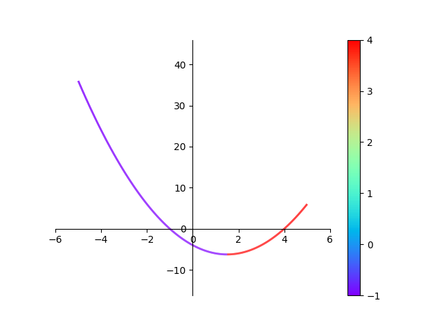
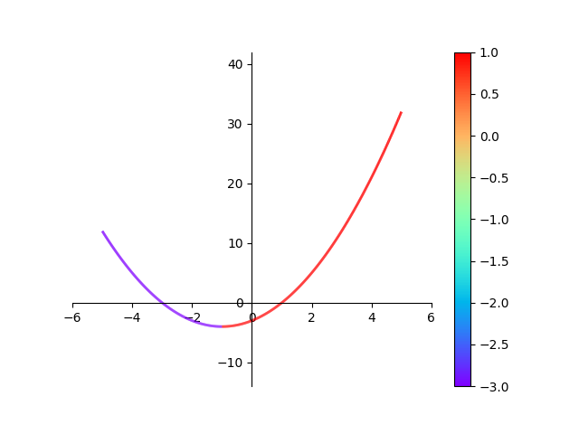
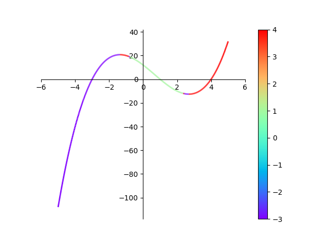
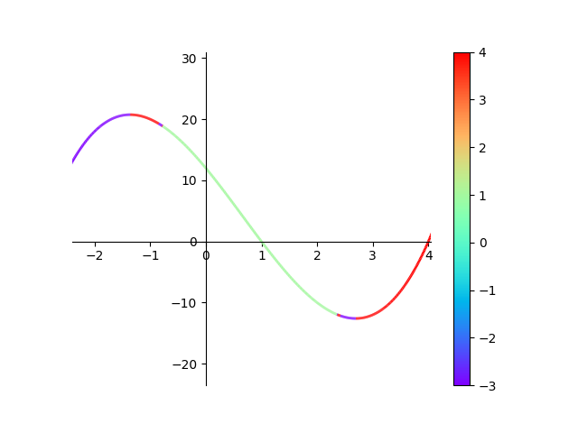
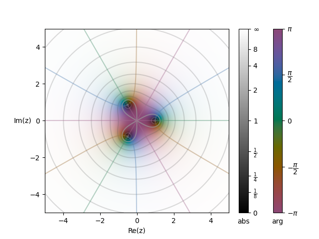
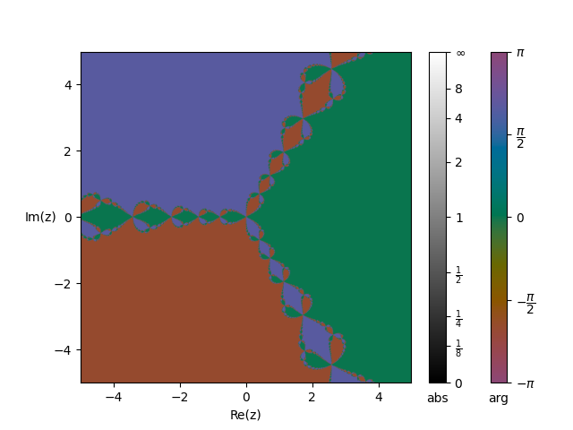
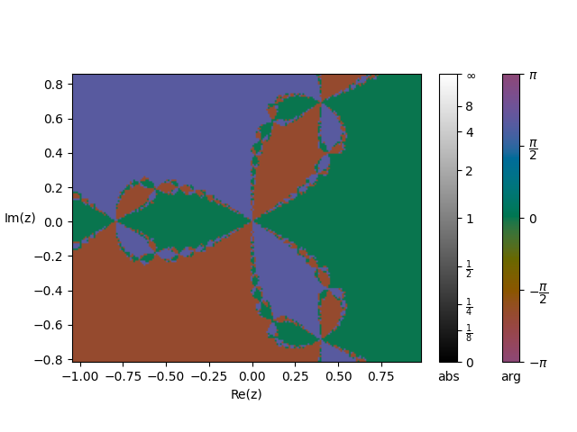

# MATH4020U-Project

## Running
To use this code simply run it from the command line as so

```bash
python main.py
```

make sure you have all dependencies installed first though. This project uses
numpy, scipy, matplotlib, and cplot. cplot is likely the one you don't have
installed use the bellow command to install cplot.

```bash
pip install cplot
```

## Description
This projects studies the basins of attractions of several real and complex
functions. To see how the chosen x value affects which if any of the roots
is reached.

Some images from the python code.









